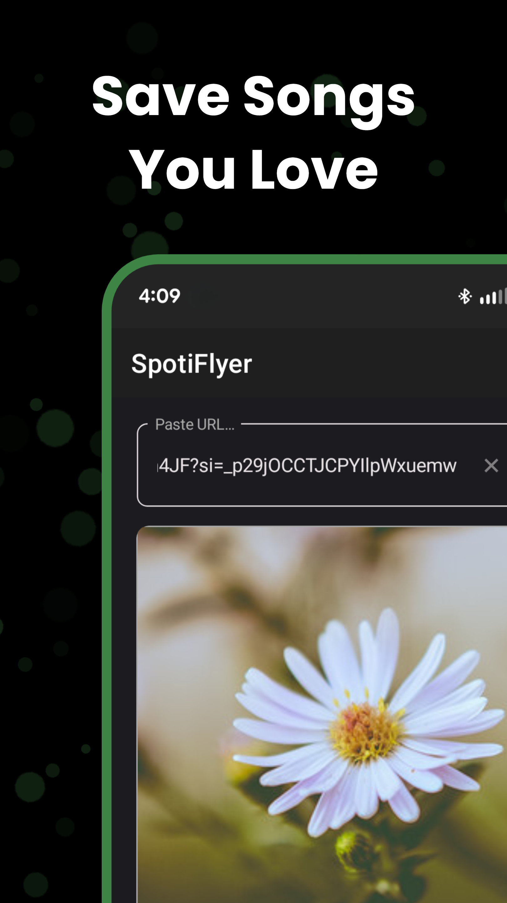
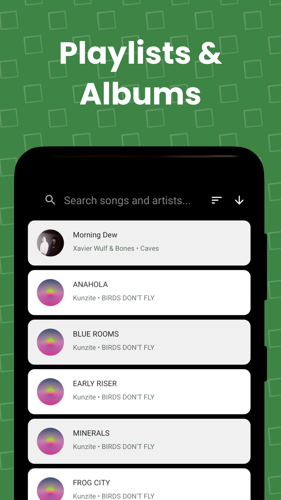

  

# SpotiFlyer 🎵⬇️

**SpotiFlyer** is an Android application built with the [.NET MAUI](https://learn.microsoft.com/en-us/dotnet/maui/) framework designed to help you download your favorite Spotify tracks for offline listening. 

SpotiFlyer does not download music directly from Spotify.  

Instead, it retrieves the metadata of your desired track(s) (title, artist, album, duration, etc..) from Spotify.  Then it uses that metadata to find and download the closest match using **Soulseek** or **yt-dlp**.

## 📸 Screenshots

  
  &nbsp;&nbsp;&nbsp;&nbsp;
  
  &nbsp;&nbsp;&nbsp;&nbsp;
  
  &nbsp;&nbsp;&nbsp;&nbsp;
  

## ✨ Features

* **Android Native Feel:** Built with the cross-platform .NET MAUI framework, optimized for a smooth Android experience.
* **Spotify Metadata Scraping:** Easily fetch accurate track details directly from Spotify links.
* **Smart Match Downloading:** Automatically finds the highest quality matching audio using two powerful backend engines:
  * **Soulseek:** Taps into the Soulseek P2P network for high-fidelity audio matches.
  * **yt-dlp:** Fallback to the powerful `yt-dlp` tool to extract audio from YouTube and other supported sources when a Soulseek match isn't optimal.
* **Easy Offline Listening:** Saves downloaded tracks directly to your device's local storage.

## 🛠 Tech Stack
* **Framework**: [.NET MAUI](https://learn.microsoft.com/en-us/dotnet/maui/) (Multi-platform App UI)
* **Language**: C#
* **Target Platform**: Android (via .NET MAUI)
* **IDE**: Visual Studio / Visual Studio for Mac

## 💡 How It Works

1. **Input:** Provide a Spotify track link within the app.
2. **Metadata Scraping:** SpotiFlyer fetches the exact track metadata (Title, Artist, Album).
3. **Search & Match:** The app forwards this metadata to its search engines (Soulseek, then yt-dlp) to find an identical download.
4. **Download:** The closest match is then downloaded straight to your Android device.

## ⚡️ Quick Start App

1. Download latest APK from [Releases](https://github.com/mvxGREEN/SpotiFLyer/releases) to an Android device.

2. Open APK file to install.

3. Done!  Open **SpotiFLyer** app to start downloading audio from Spotify.

## 💻 Build App from Source Code

### Prerequisites
* **Visual Studio 2022+** (version 17.3 or later) with the **.NET Multi-platform App UI development** workload installed.
* **Android SDK**: Visual Studio generally installs this alongside the MAUI workload, but ensure you have an Android emulator set up or a physical device ready.

### Installation & Build

1. **Clone the repository**
    `git clone https://github.com/mvxGREEN/SpotiFlyer.git`

2. **Open the project in Visual Studio**
   * Launch Visual Studio
   * Select **Open a project or solution**.
   * Navigate to the cloned directory and open solution file in Visual Studio.

3. **Restore Dependencies**
   * Wait for NuGet to automatically restore the required packages. You can also right-click the solution in the Solution Explorer and click **Restore NuGet Packages**.

4. **Run the App**
   * In the top toolbar, ensure the build target is set to an Android Emulator or your connected local Android device.
   * Click the **Play (Start Debugging)** button or press `F5` to build and deploy the app.

## 📄 License

This project is licensed under the [MIT License](LICENSE.txt). See the `LICENSE.txt` file for more details.
